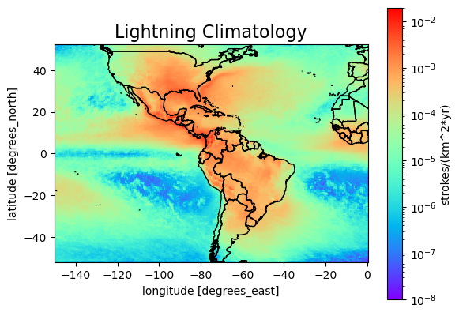

# Randall Jones' Repository for ESS569

### Installing this repository:
In order to install this repository, execute the following command:
```bash
  git clone https://github.com/UW-MLGEO/MLGEO2024_rjones98.git
```
into a command line interface.

### Running the Jupyter Notebook
In order to run the jupyter notebook (namely, ESS569_HW1.ipynb), open the notebook and click "Restart the kernel and run all cells" indicated by a fast-forward button in the top toolbar. Alternatively, press shift+enter on the code cells to run each one individually.

### Favorite Earth Science Topics:
My favorite earth science topics are:
1. Tropical Cyclones
2. Thunderstorms and Lightning (a lightning climatology map from 2010 to 2023 can be seen below)
3. Seismology



### Using Git Commands
A PDF showing screenshots of how to clone the repository and how the git add, commit and push commands are used is located at the file GitCommandsUsage.pdf.

### Licensing
The MIT license is an easily understood and implementable liscense which encourages contributions by being flexible and permissive. It is compatible with a wide range of other licenses, making it a good choice when aiming to make code widely available and encourage contributions/collaboration.
